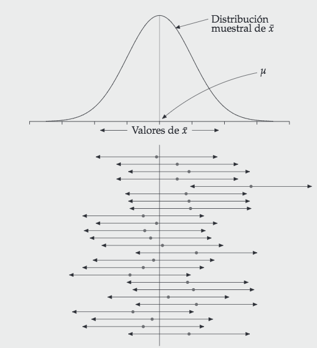

## Pasemos lista mientras descargan los materiales y dejamos todo listo ✨

::: {style="font-size: 30px;"}
📂 **Paso 1:** Abrimos nuestro proyecto con doble clic en el archivo `.Rproj`

-   Si no tienen proyecto, creamos uno: `File > New Project > New Directory > New Project` — creamos carpetas: `data`, `scripts`, `figures`, `output`

<br>

💾 **Paso 2:** Movemos el archivo **"Script Taller 7 EstadisticaII.R"** a la carpeta `scripts`

<br>

📎 **Paso 3:**  Movemos la base **data_elpi_selected_variables.RData** y **ELSOC_Wide_2016_2023.RData** a la carpeta `data`

> **Todos los materiales los pueden descargar en este link: [Materiales clases](https://github.com/mconstanzaa/estadistica-ii-uv-2026/)**
:::


## Evaluación 3

::: {style="font-size: 30px;"}
Hoy tenemos nuestra **tercera evaluación individual** en R. Debes entregar lo siguiente:

-   Proyecto de R (`.Rproj`).
-   El script (`.R`) que contiene todos los ejercicios individuales solicitados en este taller. Debes crear un script nuevo, no utilices el script de actividades entregado en la clase.
    -   En ese script, incluye un título, tu nombre, correo y fecha. Por ejemplo:

```{r echo=TRUE}
# Script Ejercicio 3 Estadística II --------------------------------------------
# M. Constanza Ayala (maria.ayala@uv.cl)
# 28-04-2026
```

**Plazo de entrega:** hoy hasta las 23:59 hrs. en el Aula Virtual.

> En caso de utilizar IA, debe reportarlo en un archivo Word, indicando la herramienta y los prompts usados. El uso no reportado será calificado con nota mínima.
:::


## Objetivos de la clase

<br>

-   Comprender la lógica de los **intervalos de confianza** para medias y proporciones

-   Calcular IC para medias y proporciones de forma **manual** con `summarise()`

-   Calcular IC para **medias** con `DescTools::MeanCI()`

-   Calcular IC para **proporciones** con `DescTools::BinomCI()`

-   **Visualizar** intervalos de confianza con `ggplot2`


## ¿Qué vimos la última clase?

<br>

✅ Formulamos hipótesis nula y alternativa\
✅ Relacionamos el puntaje Z con el valor P\
✅ Realizamos pruebas de hipótesis sobre proporciones con `prop.test()`\
✅ Aplicamos `prop.test()` con datos reales de ELSOC

<br>

💡 ¡Hoy damos el paso hacia la **estimación por intervalos**!


------------------------------------------------------------------------

## ¿Qué es un intervalo de confianza?

::: {style="font-size: 30px;"}
A partir de una muestra, construimos un **rango de valores plausibles** para el parámetro poblacional, con un nivel de confianza asociado.

$$IC = \text{estimación puntual} \pm \text{valor crítico} \times \text{error estándar}$$

**Componentes:**

-   **Estimación puntual**: x̄ o p̂ — el centro del intervalo
-   **Valor crítico**: Z o t — determina el ancho según el nivel de confianza
-   **Error estándar**: mide la variabilidad muestral esperada

> Si repitiéramos el muestreo muchas veces, el X% de los intervalos construidos contendría el verdadero parámetro poblacional.
:::


---

{fig-align="center"}

---


## IC para medias: fórmula

Cuando **σ es desconocida** (que es siempre el caso en la práctica) usamos la distribución **t** con gl = n − 1:

$$IC = \bar{x} \pm t_{gl,\,\alpha/2} \cdot \frac{s}{\sqrt{n}}$$

Donde:

-   $\bar{x}$: media muestral
-   $s$: desviación estándar muestral
-   $n$: tamaño de la muestra
-   $t_{gl,\,\alpha/2}$: valor crítico de la distribución t con gl = n − 1


--- 

| Nivel de confianza | α    | gl      | Valor crítico t (aprox.) |
|--------------------|------|---------|--------------------------|
| 90%                | 0.10 | n − 1   | ≈ 1.645 (n ≥ 100)        |
| 95%                | 0.05 | n − 1   | ≈ 1.960 (n ≥ 100)        |
| 99%                | 0.01 | n − 1   | ≈ 2.576 (n ≥ 100)        |

<br>

> Con n ≥ 30 la distribución muestral de x̄ es aproximadamente normal (TLC), lo que justifica usar t. Con n ≥ 100 el valor crítico t converge a Z. Con muestras pequeñas, t produce intervalos más anchos al estimar σ con s.


## Trade-offs: confianza, precisión y tamaño muestral

::: {style="font-size: 34px;"}
Tres factores determinan el ancho del IC:

| Factor            | Efecto sobre el IC                |
|-------------------|-----------------------------------|
| ↑ Confianza (1−α)   | IC más **ancho** → más certeza, menos precisión           |
| ↑ n               | IC más **estrecho** → más preciso |
| ↑ Variabilidad (s)          | IC más **ancho** → menos preciso      |

<br>

> No es posible aumentar simultáneamente la confianza y la precisión sin aumentar el tamaño muestral.
:::

---------------------------------------------------------------


## Carguemos los paquetes y la base de datos

```{r echo=TRUE}
options(scipen = 999)

library(tidyverse)
library(DescTools)

load("data/data_elpi_selected_variables.RData")

data %>% glimpse()
```


## IC para la media de `calculation`: cálculo manual

::: {style="font-size: 30px;"}
La variable `calculation` mide el puntaje en cálculo escrito (estandarizado: media = 0, sd = 1). Primero calculamos el IC aplicando directamente la fórmula con `summarise()`:

```{r echo=TRUE}
data %>%
  drop_na(calculation) %>%             # eliminamos NA antes de calcular
  summarise(
    n     = n(),                        # tamaño muestral
    media = mean(calculation),          # media muestral (x̄)
    s     = sd(calculation),            # desviación estándar muestral (s)
    t     = qt(0.975, df = n - 1),      # valor crítico t para IC 95% (1 - α/2)
    lwr   = media - t * (s / sqrt(n)),  # límite inferior: x̄ - t × (s/√n)
    upr   = media + t * (s / sqrt(n))   # límite superior: x̄ + t × (s/√n)
  )
```

* `qt(0.975, df = n - 1)` devuelve el valor crítico t que deja el 97.5% del área a su izquierda, equivalente al Z = 1.96 cuando n es grande.
:::


## IC para medias en R: `MeanCI()`

<br>

El paquete `DescTools` incluye la función `MeanCI()`, que calcula el IC para la media usando la distribución t:

```{r eval=FALSE, echo=TRUE}
library(DescTools)

MeanCI(x,               # vector numérico
       conf.level = 0.95, # nivel de confianza
       na.rm = TRUE)    # excluir NA
```

<br>

Devuelve tres valores: la media (`mean`) y los límites inferior (`lwr.ci`) y superior (`upr.ci`) del intervalo.


## IC para la media de `calculation`: con `MeanCI()`

::: {style="font-size: 35px;"}
`MeanCI()` reproduce el mismo resultado de forma directa:

```{r echo=TRUE}
# IC al 95% para la media de cálculo
MeanCI(data$calculation,
       conf.level = 0.95,
       na.rm = TRUE)
```

<br>

-  Con un 95% de confianza, el intervalo [-0.019 ; 0.019] contiene el verdadero puntaje promedio poblacional en cálculo escrito.
:::

## IC agrupado por nivel educativo del cuidador/a

::: {style="font-size: 30px;"}
Podemos calcular el IC para cada grupo usando `group_by()` y `summarise()`:

```{r echo=TRUE}
data %>%
  drop_na(calculation, educ2012_rec) %>%          # eliminamos NA en ambas variables
  group_by(educ2012_rec) %>%                       # agrupamos por educación del cuidador/a
  summarise(
    n     = n(),
    media = MeanCI(calculation, conf.level = 0.95)[1],   # media
    lwr   = MeanCI(calculation, conf.level = 0.95)[2],   # límite inferior
    upr   = MeanCI(calculation, conf.level = 0.95)[3]    # límite superior
  )
```

* Los grupos con mayor nivel educativo del cuidador/a tienden a mostrar puntajes promedio más altos en cálculo, con intervalos que no se superponen entre los extremos, lo que sugiere diferencias estadísticamente distinguibles entre grupos con un 95% de confianza.
:::

## Visualización del IC por grupo

::: {style="font-size: 30px;"}
```{r echo=TRUE, eval=FALSE}
data_ic <- data %>%
  drop_na(calculation, educ2012_rec) %>%          # eliminamos NA en ambas variables
  group_by(educ2012_rec) %>%                       # agrupamos por educación del cuidador/a
  summarise(
    media = MeanCI(calculation, conf.level = 0.95)[1],  # media muestral por grupo
    lwr   = MeanCI(calculation, conf.level = 0.95)[2],  # límite inferior del IC 95%
    upr   = MeanCI(calculation, conf.level = 0.95)[3]   # límite superior del IC 95%
  )

ggplot(data_ic, aes(x = educ2012_rec, y = media)) +  # educación en x, media en y
  geom_point(size = 3, color = "#9467bd") +            # punto para la media de cada grupo
  geom_errorbar(aes(ymin = lwr, ymax = upr),           # barras de error con límites del IC
                width = 0.2, color = "#9467bd") +       # ancho de las barras horizontales
  labs(title = "IC 95% para puntaje en cálculo según educación del cuidador/a",
       x = "Nivel educativo del cuidador/a",           # etiqueta eje x
       y = "Puntaje en cálculo (estandarizado)") +     # etiqueta eje y
  theme_minimal() +                                     # estilo limpio sin fondo gris
  theme(axis.text.x = element_text(angle = 25,         # rota etiquetas del eje x
                                   hjust = 1))          # alinea etiquetas rotadas a la derecha
```
:::

---

```{r echo=F}
data_ic <- data %>%
  drop_na(calculation, educ2012_rec) %>%          # eliminamos NA en ambas variables
  group_by(educ2012_rec) %>%                       # agrupamos por educación del cuidador/a
  summarise(
    media = MeanCI(calculation, conf.level = 0.95)[1],  # media muestral por grupo
    lwr   = MeanCI(calculation, conf.level = 0.95)[2],  # límite inferior del IC 95%
    upr   = MeanCI(calculation, conf.level = 0.95)[3]   # límite superior del IC 95%
  )

ggplot(data_ic, aes(x = educ2012_rec, y = media)) +  # educación en x, media en y
  geom_point(size = 3, color = "#9467bd") +            # punto para la media de cada grupo
  geom_errorbar(aes(ymin = lwr, ymax = upr),           # barras de error con límites del IC
                width = 0.2, color = "#9467bd") +       # ancho de las barras horizontales
  labs(title = "IC 95% para puntaje en cálculo según educación del cuidador/a",
       x = "Nivel educativo del cuidador/a",           # etiqueta eje x
       y = "Puntaje en cálculo (estandarizado)") +     # etiqueta eje y
  theme_minimal() +                                     # estilo limpio sin fondo gris
  theme(axis.text.x = element_text(angle = 25,         # rota etiquetas del eje x
                                   hjust = 1))          # alinea etiquetas rotadas a la derecha
```

::: {style="font-size: 30px;"}
- Los intervalos que no se superponen entre grupos sugieren diferencias estadísticamente distinguibles en el puntaje de cálculo según el nivel educativo del cuidador/a.
:::


## Actividad 1 para ejercicio

::: {style="font-size: 35px;"}
En una sección llamada `Preparación`:

1.  Carga los paquetes `tidyverse` y `DescTools`, y la base `ELSOC_Wide_2016_2023.RData`.

2.  Filtra la base para quedarte solo con las observaciones de la ola 2023 (`ola_w07 == 1`). Guarda el resultado como `data_elsoc_2023`.

3.  Recodifica los valores `-999` y `-888` como `NA` en las variables `t02_01_w07`, `t02_02_w07` y `t02_03_w07` usando `mutate()` y `case_when()`. Verifica con `table(..., exclude = FALSE)` para al menos una variable.

4.  Crea la variable `media_cohesion_barrial`: promedio de los tres ítems anteriores usando `rowMeans()` con `na.rm = TRUE`. Verifica con `summary()`.
:::


## Actividad 2 para ejercicio

::: {style="font-size: 35px;"}
En una sección llamada `IC medias`:

1.  Calcula el IC al 95% para la media de `media_cohesion_barrial` con `MeanCI()`. Interpreta el resultado como comentario (`#`) en el script.

2.  Calcula el IC al 95% agrupando por `m0_sexo_w07` usando `group_by()` y `summarise()`. Antes de calcular, recodifica `m0_sexo_w07` como factor con etiquetas (`"Hombre"`, `"Mujer"`).

3.  Crea un gráfico de puntos con barras de error (`geom_errorbar()`) para visualizar los IC por sexo. Incluye título y etiquetas de ejes.
:::

------------------------------------------------------------------------

## IC para proporciones: fórmula

::: {style="font-size: 30px;"}
Para proporciones **siempre se usa Z** (no t):

$$IC = \hat{p} \pm Z_{\alpha/2} \cdot \sqrt{\frac{\hat{p}(1-\hat{p})}{n}}$$

Donde:

-   $\hat{p}$: proporción muestral
-   $n$: tamaño de la muestra
-   $Z_{\alpha/2}$: valor crítico de la distribución normal estándar

**Condición de aplicación:** np̂ ≥ 5 y n(1 − p̂) ≥ 5

> El error estándar de una proporción depende del propio valor de p̂: es máximo cuando p̂ = 0.50 y se reduce a medida que p̂ se aleja de 0.50.
:::


---------


## Identificación con pueblo originario — cálculo manual

::: {style="font-size: 28px;"}
Usamos la variable `indig_nino` (pertenencia a pueblo originario, dicotómica). Primero aplicamos la fórmula directamente:

```{r echo=TRUE}
table(data$indig_nino, exclude = FALSE)
```

```{r echo=TRUE}
data %>%
  drop_na(indig_nino) %>%                           # eliminamos NA antes de calcular
  summarise(
    n       = n(),                                   # tamaño muestral
    n_indig = sum(indig_nino == "Indigenous"),       # casos pertenecientes a pueblo originario
    p_hat   = n_indig / n,                           # proporción muestral (p̂)
    se      = sqrt(p_hat * (1 - p_hat) / n),         # error estándar
    lwr     = p_hat - 1.96 * se,                     # límite inferior (Z = 1.96)
    upr     = p_hat + 1.96 * se                      # límite superior
  )
```

Con un 95% de confianza, el intervalo [12.9% ; 14.2%] contiene la verdadera proporción poblacional de niños/as pertenecientes a un pueblo originario en el contexto escolar chileno estudiado.
:::


## IC para proporciones en R: `BinomCI()`

::: {style="font-size: 30px;"}
`DescTools` incluye `BinomCI()` para calcular el IC de una proporción:

```{r eval=FALSE, echo=TRUE}
BinomCI(x,                    # número de casos que cumplen la condición
        n,                    # total de casos
        conf.level = 0.95,    # nivel de confianza
        method = "wald")      # método de Wald: fórmula Z estándar
```

El método `"wald"` corresponde exactamente a la fórmula:

$$IC = \hat{p} \pm Z_{\alpha/2} \cdot \sqrt{\frac{\hat{p}(1-\hat{p})}{n}}$$

> Devuelve tres valores: la proporción estimada (`est`) y los límites inferior (`lwr.ci`) y superior (`upr.ci`).
:::


## Identificación con pueblo originario — con `BinomCI()`

::: {style="font-size: 30px;"}
`BinomCI()` reproduce el mismo resultado usando el método de Wald:

```{r echo=TRUE}
n_total <- sum(!is.na(data$indig_nino))
n_indig <- sum(data$indig_nino == "Indigenous", na.rm = TRUE)

BinomCI(x = n_indig,
        n = n_total,
        conf.level = 0.95,
        method = "wald")
```

-️ La proporción estimada de niños/as pertenecientes a un pueblo originario en la muestra, junto a su intervalo de confianza al 95%, refleja la representación de esta población en el contexto escolar chileno estudiado.
:::

## IC de proporción agrupado por sexo

::: {style="font-size: 30px;"}
Podemos calcular el IC para cada grupo con `group_by()` y `summarise()`:

```{r echo=TRUE}
data %>%
  drop_na(indig_nino, sex) %>%                                                      # eliminamos NA en ambas variables
  group_by(sex) %>%                                                                  # agrupamos por sexo
  summarise(
    n       = n(),                                                                   # tamaño muestral por grupo
    n_indig = sum(indig_nino == "Indigenous"),                                       # casos por grupo
    prop    = n_indig / n,                                                           # proporción por grupo (p̂)
    lwr     = BinomCI(n_indig, n, conf.level = 0.95, method = "wald")[, "lwr.ci"],  # límite inferior IC 95%
    upr     = BinomCI(n_indig, n, conf.level = 0.95, method = "wald")[, "upr.ci"]   # límite superior IC 95%
  )
```

- La proporción de niños/as pertenecientes a pueblo originario es similar entre niñas y niños, con intervalos que se superponen ampliamente, lo que indica que no existe una diferencia estadísticamente distinguible por sexo en esta muestra.
:::

## Visualización del IC de proporción

::: {style="font-size: 30px;"}
```{r echo=TRUE, eval=FALSE}
data_ic_prop <- data %>%
  drop_na(indig_nino, sex) %>%                                                      # eliminamos NA en ambas variables
  group_by(sex) %>%                                                                  # agrupamos por sexo
  summarise(
    n       = n(),                                                                   # tamaño muestral por grupo
    n_indig = sum(indig_nino == "Indigenous"),                                       # casos por grupo
    prop    = n_indig / n,                                                           # proporción por grupo (p̂)
    lwr     = BinomCI(n_indig, n, conf.level = 0.95, method = "wald")[, "lwr.ci"],  # límite inferior IC 95%
    upr     = BinomCI(n_indig, n, conf.level = 0.95, method = "wald")[, "upr.ci"]   # límite superior IC 95%
  )

ggplot(data_ic_prop, aes(x = sex, y = prop)) +  # sexo en x, proporción en y
  geom_point(size = 3, color = "#9467bd") +       # punto para la proporción de cada grupo
  geom_errorbar(aes(ymin = lwr, ymax = upr),      # barras de error con límites del IC
                width = 0.15, color = "#9467bd") + # ancho de las barras horizontales
  scale_y_continuous(labels = scales::percent_format(accuracy = 1)) + # formato porcentaje
  labs(title = "IC 95% para proporción de niños/as de pueblo originario según sexo",
       x = "Sexo",                                # etiqueta eje x
       y = "Proporción estimada") +               # etiqueta eje y
  theme_minimal()                                  # estilo limpio sin fondo gris
```
:::

---

```{r echo=F}
data_ic_prop <- data %>%
  drop_na(indig_nino, sex) %>%                                                      # eliminamos NA en ambas variables
  group_by(sex) %>%                                                                  # agrupamos por sexo
  summarise(
    n       = n(),                                                                   # tamaño muestral por grupo
    n_indig = sum(indig_nino == "Indigenous"),                                       # casos por grupo
    prop    = n_indig / n,                                                           # proporción por grupo (p̂)
    lwr     = BinomCI(n_indig, n, conf.level = 0.95, method = "wald")[, "lwr.ci"],  # límite inferior IC 95%
    upr     = BinomCI(n_indig, n, conf.level = 0.95, method = "wald")[, "upr.ci"]   # límite superior IC 95%
  )

ggplot(data_ic_prop, aes(x = sex, y = prop)) +  # sexo en x, proporción en y
  geom_point(size = 3, color = "#9467bd") +       # punto para la proporción de cada grupo
  geom_errorbar(aes(ymin = lwr, ymax = upr),      # barras de error con límites del IC
                width = 0.15, color = "#9467bd") + # ancho de las barras horizontales
  scale_y_continuous(labels = scales::percent_format(accuracy = 1)) + # formato porcentaje
  labs(title = "IC 95% para proporción de niños/as de pueblo originario según sexo",
       x = "Sexo",                                # etiqueta eje x
       y = "Proporción estimada") +               # etiqueta eje y
  theme_minimal()                                  # estilo limpio sin fondo gris
```

---

## Actividad 3 para ejercicio

::: {style="font-size: 35px;"}
En una sección llamada `IC proporciones`:

La variable `c02_w07` mide confianza social generalizada: `1` = "casi siempre se puede confiar en las personas", `2` = "hay que tener cuidado", `3` = "depende".

1.  Recodifica los valores `-999` y `-888` como `NA` en `c02_w07`, y luego crea la variable dicotómica `confia_personas`: `1` si el valor es `1`, `0` si el valor es `2` o `3`. Usa `mutate()` y `case_when()`. Verifica con `table(..., exclude = FALSE)`.

2.  Calcula el IC al 95% para la proporción de personas que confían en los demás con `BinomCI()`. Interpreta el resultado como comentario (`#`) en el script.
:::


## ❓ Preguntas y aclaraciones

<br>

💬 **¿Dudas sobre lo visto hoy?**

-   Tómense un momento para reflexionar y compartir preguntas sobre el contenido.

-   Espacio para responder inquietudes y aclarar conceptos clave.


## Resumen clase de hoy

<br>

✅ Comprendimos la lógica de los intervalos de confianza para medias y proporciones

✅ Calculamos IC para medias con `DescTools::MeanCI()` (distribución t)

✅ Calculamos IC para proporciones con `DescTools::BinomCI()` (método de Wald)

✅ Visualizamos intervalos con `geom_errorbar()` en `ggplot2`

✅ Aplicamos ambos tipos de IC con datos reales de ELPI y ELSOC


## 📆 Próxima sesión

<br>

-   Muestreo en R

## 📚 Sugerencias lecturas para reforzar R

<br>

-   Wickham & Grolemund. R for Data Science (acceso en línea biblioteca, en español: <https://es.r4ds.hadley.nz/>)

-   [AnalizaR Datos Políticos](https://arcruz0.github.io/libroadp/index.html)

-   [YaRrr! The Pirate's Guide to R](https://bookdown.org/ndphillips/YaRrr/)
