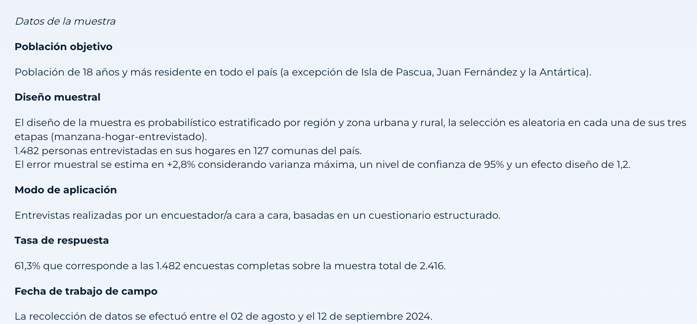
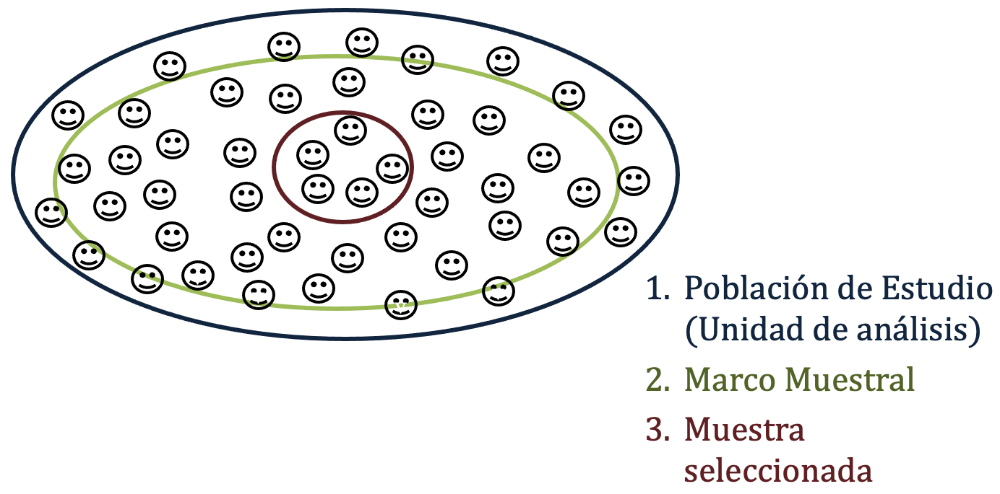

## Pasemos lista mientras descargan los materiales y dejamos todo listo ✨

::: {style="font-size: 30px;"}
📂 **Paso 1:** Abrimos nuestro proyecto con doble clic en el archivo `.Rproj`

- Si no tienen proyecto, creamos uno: `File > New Project > New Directory > New Project` — creamos carpetas: `data`, `scripts`, `figures`, `output`

<br>

💾 **Paso 2:** Movemos el archivo **"Script Taller 9 EstadisticaII.R"** a la carpeta `scripts`

<br>

📎 **Paso 3:** Verificamos que la base **base_92_20112024.Rds** esté en la carpeta `data`

> **Todos los materiales los pueden descargar en este link: [Materiales clases](https://github.com/mconstanzaa/estadistica-ii-uv-2026/)**
:::

## Objetivos de la clase

<br>

- Recordar los principales **tipos de muestreo probabilístico**

- Simular el proceso de **muestreo aleatorio simple** con `sample_n()` y `map_dbl()`

- Aplicar **muestreo estratificado** con el paquete `sampling`

- Aplicar **muestreo por conglomerados** con el paquete `sampling`

## ¿Qué vimos la última clase?

<br>

✅ Calculamos IC para proporciones de forma manual con `summarise()`\
✅ Calculamos IC para proporciones con `BinomCI()` (método de Wald)\
✅ Comparamos IC obtenidos con distintos niveles de confianza

<br>

💡 ¡Hoy damos el paso hacia el **diseño muestral** en R!

## Actividades prácticas

A lo largo de la clase realizaremos **tres actividades prácticas**, una por tipo de muestreo.

No tienen nota, pero recomiendo resolverlas en un script aparte para que quede como material de estudio.

- Crea un script nuevo e incluye un título, tu nombre, correo y fecha:

```{r echo=TRUE}
# Actividades Taller 9 Estadística II --------------------------------------------
# M. Constanza Ayala (maria.ayala@uv.cl)
# 26-05-2026
```

------------------------------------------------------------------------

## Universo, marco muestral y muestra

<br>

- **Universo:** conjunto completo de elementos que la investigación busca estudiar — es el referente teórico de la inferencia.\
- **Marco muestral:** lista operacional desde la cual se extrae la muestra (idealmente cubre todo el universo).\
- **Muestra:** subconjunto seleccionado del marco. Si la selección fue aleatoria → se puede generalizar al universo con error conocido.

------------------------------------------------------------------------

## CEP 92

{fig-align="center"}

------------------------------------------------------------------------

## Diseño muestral

{fig-align="center" width="80%"}

------------------------------------------------------------------------

## Tipos de muestreo probabilístico: definiciones

::: {style="font-size: 27px;"}
* **Aleatorio simple (MAS)** Todos los casos tienen igual probabilidad de ser seleccionados. No se usa información auxiliar de la población.

* **Sistemático** Se selecciona cada k-ésimo elemento de la lista (k = N/n). Parte de un primer sujeto elegido al azar.

* **Estratificado** La población se divide en subpoblaciones no sobrepuestas (estratos) y se sortea de forma independiente dentro de cada uno.

* **Por conglomerados** La población se divide en grupos naturales (comunas, escuelas, regiones) y se seleccionan aleatoriamente algunos grupos completos.

* **Multietápico** Combina dos o más de los métodos anteriores sobre distintas unidades — por ejemplo, estratos de regiones → conglomerados de manzanas → MAS de individuos. Es el diseño de la CEP.

> En este taller implementamos en R: **MAS**, **estratificado** y **conglomerados**.
:::

------------------------------------------------------------------------

## Carguemos los paquetes y la base de datos

```{r echo=TRUE, message=FALSE, warning=FALSE}
library(tidyverse)
library(haven)
library(sampling)

data <- readRDS("data/base_92_20112024.Rds")

data %>% glimpse()
```

## Preparación: recodificar valores perdidos

::: {style="font-size: 30px;"}
Antes de trabajar con cualquier variable, recodificamos los valores no válidos como `NA`:

```{r echo=TRUE}
data <- data %>%
  mutate(
    democracia_19 = case_when(
      democracia_19 %in% c(-8, -9) ~ NA_real_,
      TRUE ~ democracia_19
    ),
    bienestar_2 = case_when(
      bienestar_2 %in% c(-8, -9) ~ NA_real_,
      TRUE ~ bienestar_2
    )
  )
```

> `democracia_19`: preferencia entre libertades públicas (1) y orden público (10) · `bienestar_2`: satisfacción con la vida (1–10).
:::

------------------------------------------------------------------------

## Valores de referencia

::: {style="font-size: 30px;"}
Antes de simular muestras, calculamos los estadísticos en la base completa. La CEP 92 es en sí misma una muestra, no la población chilena, pero para este ejercicio **la trataremos como nuestra población de referencia**: extraeremos submuestras de ella y las compararemos.

```{r echo=TRUE}
data %>%
  summarise(
    media_democracia = mean(democracia_19, na.rm = TRUE),
    media_satisf     = mean(bienestar_2,   na.rm = TRUE),
    n                = n()
  )
```

> Esto nos permitirá ver cómo varía una estimación muestral respecto al valor que la muestra completa entrega, simulando la lógica de la inferencia estadística.
:::

------------------------------------------------------------------------

## Muestreo Aleatorio Simple (MAS)

::: {style="font-size: 30px;"}
> Seleccionamos casos de forma completamente aleatoria, donde **cada unidad del marco tiene la misma probabilidad** de ser incluida en la muestra.

En R usamos `sample_n()` del paquete `dplyr`:

```{r echo=TRUE}
sample_n(data,        # base de datos (el "marco muestral")
       size = 10,  # tamaño de la muestra
       replace = FALSE)  # sin reemplazo (por defecto); FALSE → cada persona se selecciona máximo una vez; TRUE  → una persona podría salir más de una vez
```
:::

------------------------------------------------------------------------

## MAS: una muestra

```{r echo=TRUE}
set.seed(2026)  # fija la semilla para reproducibilidad

muestra_mas <- data %>%
  sample_n(100)

# Estimamos el promedio en esta muestra
mean(muestra_mas$democracia_19, na.rm = TRUE)
```


::: {style="font-size: 30px;"} 
> El resultado  difiere del valor que obtuvimos con la base completa (8.21). Esto es esperable: cada muestra captura una fracción distinta de los datos. Si volviéramos a extraer 100 casos distintos, obtendríamos otro valor. A esto se le llama variabilidad muestral 
:::

------------------------------------------------------------------------

## MAS: con y sin reemplazo

::: {style="font-size: 30px;"}

```{r echo=TRUE}
# Sin reemplazo: un caso solo puede aparecer una vez (lo más común)
muestra_sin  <- data %>% sample_n(100, replace = FALSE)

# Con reemplazo: un caso puede ser seleccionado más de una vez
muestra_con  <- data %>% sample_n(100, replace = TRUE)

# Verificamos duplicados
table(duplicated(muestra_sin$id_bu))
table(duplicated(muestra_con$id_bu))
```

El muestreo **con reemplazo** simula poblaciones infinitas, lo que permite repetir el proceso de muestreo muchas veces sobre la misma base sin agotarla. En encuestas presenciales, como la CEP, se usa siempre **sin reemplazo**.
:::

------------------------------------------------------------------------

## ¿Y si repetimos el muestreo muchas veces?

::: {style="font-size: 33px;"} 
Cada muestra produce una estimación diferente. Si repetimos el proceso 1000 veces podemos visualizar la **distribución muestral** de la media, es decir, cómo se comporta el estimador en el largo plazo.

Para esto usamos `map_dbl()` del paquete `purrr` (parte de `tidyverse`):

```{r echo=TRUE}
simulaciones <- map_dbl(1:1000, ~{
  muestra <- sample_n(data, 100)                      # tomamos una muestra
  mean(muestra$democracia_19, na.rm = TRUE)            # calculamos su media
})

mean(simulaciones)
```

> En lugar de repetir el mismo código 1000 veces, `map_dbl()` automatiza el proceso y devuelve un vector de 1000 medias muestrales. 
:::

------------------------------------------------------------------------

## Distribución muestral de la media

::: {style="font-size: 22px;"}

```{r echo=TRUE}
hist(simulaciones,
     probability = TRUE,              # escala de densidad (no frecuencia)
     main = "Distribución de 1000 medias muestrales (n = 100 c/u)", # título
     xlab = "Media democracia_19",    # etiqueta eje x
     col  = "darkgrey", border = "white") # color barras y bordes
curve(dnorm(x, mean = mean(simulaciones), sd = sd(simulaciones)), # curva normal teórica
      col = "red", lwd = 2, add = TRUE) # color rojo, grosor 2, sobre el histograma
abline(v = mean(simulaciones), col = "blue", lty = 2, lwd = 2) # línea vertical en la media
```

:::

------------------------------------------------------------------------

## Interpretación

<br>

::: {style="font-size: 33px;"} 
- Las medias muestrales se distribuyen **aproximadamente de forma normal** alrededor del valor de la base completa.
- Esta propiedad se sostiene **aunque la variable original no sea normal**, es lo que garantiza el Teorema Central del Límite (TCL).
- La dispersión del histograma representa el **error estándar**: cuanto mayor sea el tamaño muestral n, más estrecha es la distribución y más precisa la estimación.
- Este es el fundamento matemático que permite hacer **inferencia estadística** a partir de una sola muestra.
:::

------------------------------------------------------------------------

## Actividad práctica 1 - MAS

<br>

::: {style="font-size: 30px;"}
En una sección del script llamada `Muestreo Aleatorio Simple`:

1.  Carga los paquetes `tidyverse`, `haven` y `sampling`. Carga la base `base_92_20112024.Rds`. Recodifica los valores `-8` y `-9` como `NA` en `bienestar_2` con `mutate()` y `case_when()`.

2.  Fija la semilla con `set.seed(2026)` y extrae una muestra aleatoria simple de **200 casos** con `sample_n()`. Guárdala como `muestra_mas`.

3.  Calcula la media de `bienestar_2` (satisfacción con la vida) en la muestra. Compárala con la media en la base completa. Escribe como comentario (`#`) qué diferencia observas.

4.  Repite el muestreo 1000 veces usando `map_dbl()` y construye el histograma de medias muestrales. Escribe como comentario (`#`) qué forma tiene la distribución y por qué. 
:::

------------------------------------------------------------------------

## Muestreo Estratificado

::: {style="font-size: 33px;"}
> La población se divide en **estratos homogéneos** y se extrae una muestra aleatoria dentro de cada uno, asegurando su representación proporcional en la muestra final.

<br>

**¿Por qué estratificar?**

* Con MAS puro, un grupo pequeño podría quedar con muy pocos casos por azar. El muestreo estratificado **garantiza** que cada subgrupo esté representado en la proporción que corresponde a su tamaño real en la población.

* En R usamos `strata()` del paquete `sampling`. 
:::

------------------------------------------------------------------------

## Estratificado por sexo

::: {style="font-size: 30px;"}

```{r echo=TRUE}
# Revisamos la distribución del estrato
table(data$sexo)
prop.table(table(data$sexo))
# 1 = Hombre (39%), 2 = Mujer (61%)
```

```{r echo=TRUE}
# La base debe estar ordenada por la variable de estrato
data <- data %>% arrange(sexo)

# Definimos el tamaño proporcional: n = 150 → ~39% Hombre, ~61% Mujer
estratos <- strata(data,
                   stratanames = c("sexo"),  # variable de estrato
                   size = c(58, 92),         # nᵢ por estrato (proporcional a 150)
                   method = "srswor")        # muestreo sin reemplazo dentro de cada estrato

table(estratos$sexo)
```

:::

------------------------------------------------------------------------

## Extraer la muestra estratificada

::: {style="font-size: 30px;"}

```{r echo=TRUE}
# Extraemos los datos de la muestra
muestra_estrat <- getdata(data, estratos)

# Verificamos la distribución resultante
table(muestra_estrat$sexo)
prop.table(table(muestra_estrat$sexo))

# Estimamos la media de democracia_19 por estrato
muestra_estrat %>%
group_by(sexo) %>%
summarise(
  media_democracia = mean(democracia_19, na.rm = TRUE),
  n                = n()
)
```
:::

------------------------------------------------------------------------

## Estratificado por dos variables

::: {style="font-size: 30px;"} 
También podemos estratificar por dos variables simultáneamente — por ejemplo, sexo y GSE:

```{r echo=TRUE}
# Recodificamos GSE a 4 categorías (D y E juntos)
data <- data %>%
  mutate(gse_4cat = case_when(
  gse %in% c(4, 5) ~ 4,
  TRUE             ~ gse
  ))

# Ordenamos por ambas variables de estrato
data <- data %>% arrange(sexo, gse_4cat)

# 2 × 4 = 8 estratos, 10 casos por estrato
estratos_2 <- strata(data,
                   stratanames = c("sexo", "gse_4cat"),
                   size = rep(10, 8),
                   method = "srswor")

muestra_estrat_2 <- getdata(data, estratos_2)
table(muestra_estrat_2$sexo, muestra_estrat_2$gse_4cat)
```
:::

------------------------------------------------------------------------

## Actividad práctica 2 - Estratificado

<br>

::: {style="font-size: 33px;"} 
En una sección del script llamada `Muestreo Estratificado`:

1. Revisa la distribución de `zona_u_r` con `table()` y `prop.table()`.

2. Calcula manualmente el tamaño proporcional para cada estrato con n = 150 e inclúyelo como comentario (`#`) en el script.

3. Ordena la base por `zona_u_r` con `arrange()` y extrae una muestra estratificada con `strata()` usando los tamaños que calculaste.

4. Extrae la muestra con `getdata()` y verifica la distribución resultante con `table()` y `prop.table()`.

5. Calcula la media de `bienestar_2` por zona con `group_by()` y `summarise()`. Escribe como comentario (`#`) qué diferencias observas.
:::

------------------------------------------------------------------------

## Muestreo por Conglomerados

<br>

::: {style="font-size: 33px;"} 
> La población se divide en **grupos naturales o conglomerados** (comunas, escuelas, regiones) y se seleccionan aleatoriamente algunos de estos grupos. Todos los elementos dentro de los grupos seleccionados conforman la muestra, o bien se realiza una segunda etapa de selección dentro de ellos.

<br>

**¿Cuándo usarlo?**

* Cuando la población está geográficamente dispersa y contar con un marco completo de individuos es inviable o muy costoso. Es el diseño más común en encuestas nacionales cara a cara (como la CEP). 
:::

------------------------------------------------------------------------

## Conglomerados: selección de grupos

```{r echo=TRUE}
# Revisamos las macro-zonas disponibles como conglomerados
table(data$region_3)

# Seleccionamos 3 macro-zonas al azar
muestra_conglom <- cluster(data,
                         clustername = "region_3",  # variable de conglomerado
                         size = 3,                  # número de grupos a seleccionar
                         method = "srswor")

# Extraemos los datos de las zonas seleccionadas
muestra_conglom_final <- getdata(data, muestra_conglom)

# ¿Qué macro-zonas fueron seleccionadas?
unique(muestra_conglom_final$region_3)
```

------------------------------------------------------------------------

## Conglomerados: segunda etapa

::: {style="font-size: 30px;"} 
En el muestreo por conglomerados en dos etapas, dentro de cada grupo seleccionado se realiza una segunda selección aleatoria:

```{r echo=TRUE}
# Segunda etapa: 30 casos por macro-zona seleccionada
muestra_2etapas <- muestra_conglom_final %>%
  group_by(region_3) %>%
  slice_sample(n = 30) %>%
  ungroup()

table(muestra_2etapas$region_3)
```

```{r echo=TRUE}
# También podemos seleccionar una proporción en vez de un número fijo
muestra_2etapas_prop <- muestra_conglom_final %>%
  group_by(region_3) %>%
  slice_sample(prop = 0.50) %>%  # 50% de cada grupo
  ungroup()

table(muestra_2etapas_prop$region_3)
```

:::

------------------------------------------------------------------------

## Actividad práctica 3 - Conglomerados

<br>

::: {style="font-size: 33px;"} 
En una sección del script llamada `Muestreo por Conglomerados`:

1.  Selecciona **4 macro-zonas** al azar con `cluster()` usando `region_3` como conglomerado.

2.  Extrae los datos con `getdata()` y verifica qué macro-zonas fueron seleccionadas con `unique()`.

3.  Aplica una segunda etapa seleccionando el **40%** de los casos dentro de cada macro-zona con `slice_sample(prop = 0.40)`. Verifica la distribución con `table()`.

4.  Calcula la media de `bienestar_2` (satisfacción con la vida) en la muestra de dos etapas con `summarise()`. Escribe como comentario (`#`) cómo se compara con el valor poblacional calculado al inicio de la clase. 
:::

------------------------------------------------------------------------

## Comparación entre tipos de muestreo

::: {style="font-size: 28px;"}
Comparamos las estimaciones de cada diseño con el valor de la base completa:

```{r echo=TRUE}
# Valor de referencia (base CEP completa)
media_ref  <- mean(data$democracia_19, na.rm = TRUE)

# Media en muestra MAS (n = 100)
media_mas  <- mean(muestra_mas$democracia_19, na.rm = TRUE)

# Media en muestra estratificada
media_est  <- mean(muestra_estrat$democracia_19, na.rm = TRUE)

# Media en muestra conglomerados (dos etapas)
media_cong <- mean(muestra_2etapas$democracia_19, na.rm = TRUE)

tibble(
  tipo  = c("Base completa (ref.)", "MAS", "Estratificado", "Conglomerados"),
  media = round(c(media_ref, media_mas, media_est, media_cong), 3)
)
```

> Recuerda: la base completa es también una muestra, no la población real. Las diferencias entre estimaciones reflejan la **variabilidad muestral**.
:::

------------------------------------------------------------------------

## ❓ Preguntas y aclaraciones

<br>

💬 **¿Dudas sobre lo visto hoy?**

- Tómense un momento para reflexionar y compartir preguntas sobre el contenido.

- Espacio para responder inquietudes y aclarar conceptos clave.

## Resumen clase de hoy

<br>

✅ Distinguimos los conceptos de universo, marco muestral y muestra

✅ Identificamos los tipos de muestreo probabilístico y cuándo usar cada uno

✅ Aplicamos MAS con `sample_n()` y visualizamos la distribución muestral con `map_dbl()`

✅ Aplicamos muestreo estratificado con `strata()` y `getdata()`

✅ Aplicamos muestreo por conglomerados con `cluster()` en dos etapas

## 📆 Próxima sesión

<br>

- Pruebas de hipótesis

## 📚 Sugerencias lecturas para reforzar R

<br>

- Wickham & Grolemund. R for Data Science (acceso en línea biblioteca, en español: <https://es.r4ds.hadley.nz/>)

- [AnalizaR Datos Políticos](https://arcruz0.github.io/libroadp/index.html)

- [YaRrr! The Pirate's Guide to R](https://bookdown.org/ndphillips/YaRrr/)
