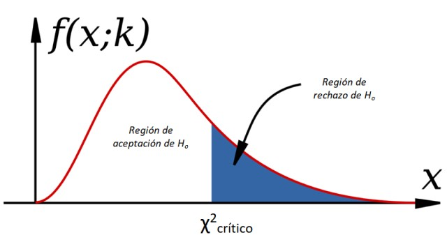

## Pasemos lista mientras descargan los materiales y dejamos todo listo ✨

::: {style="font-size: 30px;"}
📂 **Paso 1:** Abrimos nuestro proyecto con doble clic en el archivo `.Rproj`

- Si no tienen proyecto, creamos uno: `File > New Project > New Directory > New Project` — creamos carpetas: `data`, `scripts`, `figures`, `output`

<br>

💾 **Paso 2:** Movemos el archivo **"Script Taller 12 EstadisticaII.R"** a la carpeta `scripts`

<br>

📎 **Paso 3:** Verificamos que la base **base_92_20112024.Rds** esté en la carpeta `data`

> **Todos los materiales los pueden descargar en este link: [Materiales clases](https://github.com/mconstanzaa/estadistica-ii-uv-2026/)**
:::

## Objetivos de la clase

<br>

- Aplicar la prueba **Chi-cuadrado** ($\chi^2$) para evaluar la relación entre dos variables categóricas

- Calcular e interpretar la **V de Cramer** como medida de fuerza de asociación

- Analizar los **residuos tipificados corregidos** para identificar qué celdas contribuyen más a la asociación

------------------------------------------------------------------------

## Evaluación recuperativa

::: {style="font-size: 29px;"}
Hoy tenemos la **evaluación individual recuperativa** en R. Debes entregar lo siguiente:

- Proyecto de R (`.Rproj`).
- El script (`.R`) que contiene todos los ejercicios individuales solicitados en este taller. Debes crear un script nuevo, no utilices el script de actividades entregado en la clase.
  - En ese script, incluye un título, tu nombre, correo y fecha. Por ejemplo:

```{r echo=TRUE}
# Script Ejercicio recuperativo Estadística II --------------------------------------------
# M. Constanza Ayala (maria.ayala@uv.cl)
# 16-05-2026
```

**Plazo de entrega:** hoy hasta las 17:45 hrs. al correo [maria.ayala@uv.cl](mailto:maria.ayala@uv.cl). Debe esperar que la profesora confirme la recepción de su correo.

> En caso de utilizar IA, debe reportarlo en un archivo Word, indicando la herramienta y los prompts usados. El uso no reportado será calificado con nota mínima.
:::

------------------------------------------------------------------------

## ¿Cómo analizamos la relación entre dos variables categóricas?

**Paso 1 → Existencia de asociación:**\
— Aplicamos prueba **Chi-cuadrado** ($\chi^2$)\
— ¿Existe relación entre las variables?

**Paso 2 → Fuerza de la asociación:**\
— Calculamos **V de Cramer**\
— ¿Qué tan fuerte es la relación?

**Paso 3 → Contribución de las categorías:**\
— Analizamos **residuos tipificados corregidos**\
— ¿Qué combinaciones de categorías contribuyen más la asociación observada?

------------------------------------------------------------------------

## Chi-cuadrado ($\chi^2$)

::: {style="font-size: 28px;"}
- Permite evaluar la existencia de **asociación entre dos variables categóricas** (nominales u ordinales).

- Trabaja a partir de **frecuencias dentro de tablas de contingencia**: compara lo que se observa en los datos con lo que se esperaría si las variables fueran completamente independientes.

- Nos permite saber si el comportamiento de los atributos de una variable **cambia según los atributos de otra variable**.
:::

{fig-align="center" width="50%"}

------------------------------------------------------------------------

## Supuestos del Chi-cuadrado

<br>

::: {style="font-size: 31px;"}
1.  **Variables categóricas** — nominales u ordinales. No aplica para variables continuas.

2.  **Observaciones independientes** — cada sujeto aparece en una sola celda de la tabla.

3.  **Frecuencias esperadas ≥ 5** en al menos el 80% de las celdas de la tabla de contingencia.

4.  **Tamaño muestral razonablemente grande** — n \> 30.

> Si alguna celda tiene frecuencia esperada \< 5 → combinar categorías o usar la prueba exacta de Fisher (solo para tablas 2×2). Verificaremos el supuesto 3 en R al momento de aplicar el test.
:::

------------------------------------------------------------------------

## Carguemos los paquetes y la base de datos

::: {style="font-size: 26px;"}
Base de datos: **Encuesta CEP N° 92**, Agosto–Septiembre 2024. Analizaremos la relación entre actitud frente a la homoparentalidad y sexo.

```{r echo=TRUE, message=FALSE, warning=FALSE}
options(scipen=999) # Desactivamos notación científica
# Paquetes ----------------------------------------------------------------
library(tidyverse)   # Manipulación de datos y gráficos
library(haven)       # Importar bases de datos
library(sjPlot)      # Tablas de contingencia
library(DescTools)  # V de Cramer

# Carga y exploración de datos --------------------------------------------
data <- readRDS("data/base_92_20112024.Rds")
data %>% glimpse()
```
:::

------------------------------------------------------------------------

## Preparación: recodificar valores perdidos y etiquetar

::: {style="font-size: 35px;"}
```{r echo=TRUE}
# Recodificamos valores no válidos (-8 no sabe, -9 no contesta) como NA
data <- data %>%
  mutate(mtf_45_h = case_when(
    mtf_45_h %in% c(-8, -9) ~ NA_real_,
    TRUE ~ mtf_45_h
  ))

# Asignamos etiquetas a las categorías
data$mtf_45_h <- factor(data$mtf_45_h,
                        levels = c(1:5),
                        labels = c("Muy de acuerdo",
                                   "De acuerdo",
                                   "Ni de acuerdo ni en desacuerdo",
                                   "En desacuerdo",
                                   "Muy en desacuerdo"))

data$sexo <- factor(data$sexo,
                    levels = c(1:2),
                    labels = c("Hombre", "Mujer"))
```
:::

------------------------------------------------------------------------

## Verificación de NA y reducción de la base

```{r echo=TRUE}
# Contamos los NA en cada variable
sum(is.na(data$mtf_45_h))
sum(is.na(data$sexo))

# Eliminamos los NA de la variable mtf_45_h
data <- data %>%
  drop_na(mtf_45_h)

dim(data) # Verificamos el tamaño resultante
```

------------------------------------------------------------------------

## Descriptivos univariados

::: {style="font-size: 28px;"}
Antes del análisis bivariado, exploramos la distribución de cada variable por separado:

```{r echo=TRUE}
# Variable sexo
data %>%
  group_by(Sexo = sexo) %>%
  summarise(
    N          = n(),
    Porcentaje = round(100 * n() / nrow(data), 1)
  )
```

```{r echo=TRUE}
# Variable homoparentalidad
data %>%
  group_by(Homoparentalidad = mtf_45_h) %>%
  summarise(
    N          = n(),
    Porcentaje = round(100 * n() / nrow(data), 1)
  )
```
:::

------------------------------------------------------------------------

## Tabla de contingencia

::: {style="font-size: 22px;"}
La tabla de contingencia cruza las dos variables y muestra la distribución conjunta. Con `show.col.prc = TRUE` obtenemos los **porcentajes por columna**, lo que permite comparar las distribuciones entre grupos:

```{r echo=TRUE}
#Paquete sjPlot
sjt.xtab(data$mtf_45_h, data$sexo,
         show.col.prc = TRUE,         # Porcentajes por columna, para filas ocupar show.row.prc
         digits       = 2,
         var.labels   = c("Actitud frente a la homoparentalidad", "Sexo"))
```

> Para interpretar: leemos **dentro de cada columna** (cada grupo de sexo) y comparamos las proporciones. Si los porcentajes difieren entre columnas, hay indicios de asociación.
:::

------------------------------------------------------------------------

## Chi-cuadrado en R

::: {style="font-size: 28px;"}
```{r echo=TRUE}
# Verificamos el supuesto: frecuencias esperadas >= 5 en al menos el 80% de las celdas
chisq.test(data$mtf_45_h, data$sexo)$expected

# Aplicamos el test
chisq.test(data$mtf_45_h, data$sexo)
```

- **X-squared**: el estadístico $\chi^2$ calculado
- **df**: grados de libertad = (filas − 1) × (columnas − 1)
- **p-value**: probabilidad de obtener un $\chi^2$ igual o mayor si H₀ fuera verdadera

> Si **p \< 0.05** → rechazamos H₀ de independencia → existe asociación estadísticamente significativa entre las variables.
:::

------------------------------------------------------------------------

## Actividad práctica 1

::: {style="font-size: 28px;"}
Van a trabajar con la variable `percepcion_3`: *¿Ud. piensa que en los próximos 12 meses la situación económica del país mejorará, no cambiará o empeorará?* En una sección llamada `Preparación`:

1.  Carga los paquetes `tidyverse`, `haven`, `sjPlot` y `DescTools`, y la base `base_92_20112024.Rds`.

2.  Recodifica los valores no válidos de `percepcion_3` con `case_when()` (valores -8 y -9 como `NA_real_`).

3.  Asigna etiquetas con `factor()` a la variable `percepcion_3`: 1 = "Mejorará", 2 = "No cambiará", 3 = "Empeorará". Realiza el mismo procedimiento con la variable `sexo`: 1 = "Hombre", 2 = "Mujer".

4.  Elimina los NA de `percepcion_3` con `drop_na()` y verifica el tamaño de la base con `dim()`.

5.  En una sección llamada `Chi-cuadrado`: Construye la tabla de contingencia con `sjt.xtab()` y aplica `chisq.test()`. Escribe como comentario (`#`) si se cumplen los supuestos de chi-cuadrado, si existe o no asociación y por qué.
:::

------------------------------------------------------------------------

## V de Cramer

::: {style="font-size: 33px;"}
- La prueba $\chi^2$ indica **si existe** asociación, pero no dice nada sobre su **magnitud**.

- La **V de Cramer** complementa ese resultado: mide la **fuerza de la asociación** entre dos variables categóricas.

- Su rango va de 0 (sin asociación) a 1 (asociación perfecta).

| Tamaño del efecto | V de Cramer |
|:------------------|:-----------:|
| Muy débil         |   \< 0.10   |
| Débil a moderada  | 0.10 – 0.29 |
| Moderada a fuerte | 0.30 – 0.49 |
| Fuerte            |   ≥ 0.50    |
:::

------------------------------------------------------------------------

## V de Cramer en R

::: {style="font-size: 30px;"}
```{r echo=TRUE}
# Creamos la tabla de contingencia como objeto
tabla <- table(data$mtf_45_h, data$sexo)

# Calculamos V de Cramer con el paquete DescTools
CramerV(tabla)
```

<br>

Para interpretar el resultado, combinamos la significación del $\chi^2$ con el valor de V:

> Un valor de V ≈ 0.20 indica una **asociación débil a moderada**: existe una relación estadísticamente significativa entre actitud frente a la homoparentalidad y sexo, pero las diferencias entre hombres y mujeres no son de gran magnitud.
:::

------------------------------------------------------------------------

## Residuos tipificados corregidos

<br>

::: {style="font-size: 35px;"}
El $\chi^2$ y la V de Cramer nos dicen que hay asociación y cuán fuerte es, pero **no señalan dónde está**. Los residuos tipificados corregidos permiten identificar **qué celdas específicas** de la tabla contribuyen más a la asociación observada.

- Un **residuo positivo** indica que esa combinación de categorías ocurre **más de lo que se esperaría** si las variables fueran independientes.
- Un **residuo negativo** indica que ocurre **menos de lo que se esperaría** bajo independencia.
- Valores **\> ±1.96** indican que esa celda contribuye significativamente a la asociación (α = 0.05).
:::

------------------------------------------------------------------------

## Residuos tipificados corregidos en R

::: {style="font-size: 28px;"}
```{r echo=TRUE}
chi <- chisq.test(tabla)   # Guardamos el resultado del test

# Extraemos los residuos tipificados corregidos
chi$stdres
```

<br>

Para interpretar: identificamos las celdas con valores fuera del rango ±1.96 y describimos el patrón.

> Ejemplo: un residuo de −4.74 en "Muy de acuerdo / Hombre" indica que **menos hombres de los esperados** están muy de acuerdo con la homoparentalidad. El patrón opuesto en las mujeres (residuo +4.74) confirma que **la diferencia entre sexos se concentra en los extremos de la escala de acuerdo**.
:::

------------------------------------------------------------------------

## Actividad práctica 2

<br>

::: {style="font-size: 33px;"}
Con las mismas variables de la Actividad 1 (`percepcion_3` × `sexo`):

1.  Crea la tabla de contingencia como objeto llamado `tabla` con `table()`.

2.  Calcula la **V de Cramer** con `CramerV()`. Escribe como comentario (`#`) qué tan fuerte es la asociación.

3.  Calcula los **residuos tipificados corregidos** con `chisq.test()$stdres`. Escribe como comentario (`#`):

    - ¿Qué celdas tienen valores fuera de ±1.96?
    - ¿En qué categoría y grupo se concentran las diferencias más importantes?
:::

------------------------------------------------------------------------

## ❓ Preguntas y aclaraciones

<br>

💬 **¿Dudas sobre lo visto hoy?**

- Tómense un momento para reflexionar y compartir preguntas sobre el contenido.

- Espacio para responder inquietudes y aclarar conceptos clave.

## Resumen clase de hoy

<br>

✅ Aplicamos la prueba **Chi-cuadrado** ($\chi^2$) para evaluar la existencia de asociación entre dos variables categóricas

✅ Calculamos la **V de Cramer** para interpretar la fuerza de la asociación

✅ Analizamos los **residuos tipificados corregidos** para identificar qué celdas contribuyen más a la asociación observada

## 📚 Sugerencias lecturas para reforzar R

<br>

- Wickham & Grolemund. R for Data Science (acceso en línea biblioteca, en español: <https://es.r4ds.hadley.nz/>)

- [AnalizaR Datos Políticos](https://arcruz0.github.io/libroadp/index.html)

- [YaRrr! The Pirate's Guide to R](https://bookdown.org/ndphillips/YaRrr/)
